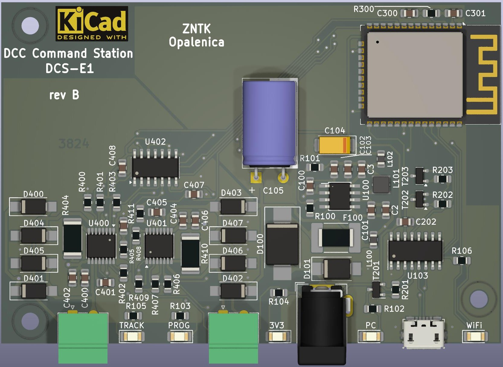
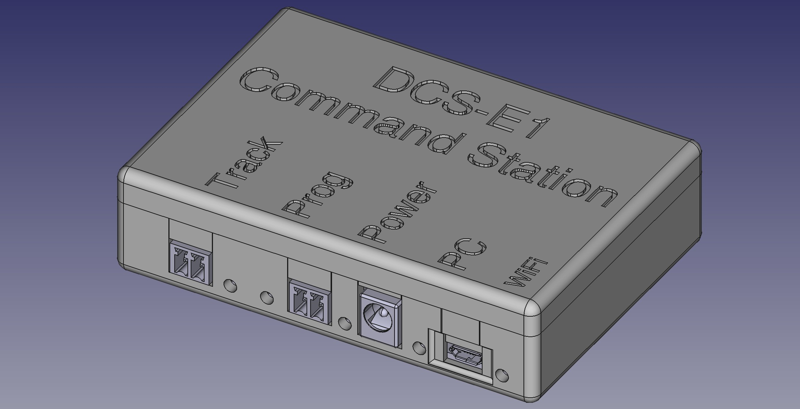
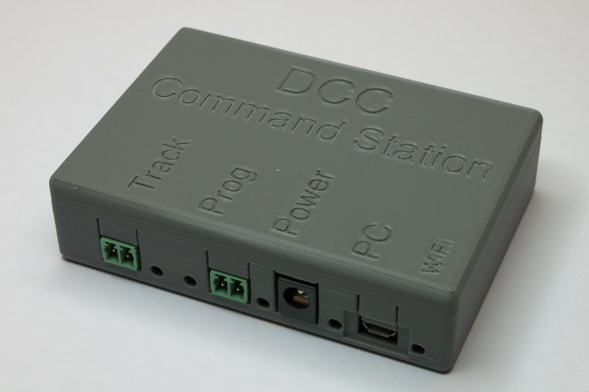
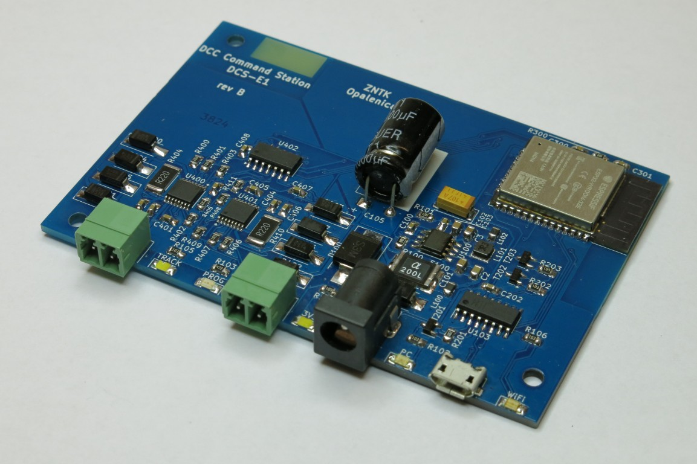
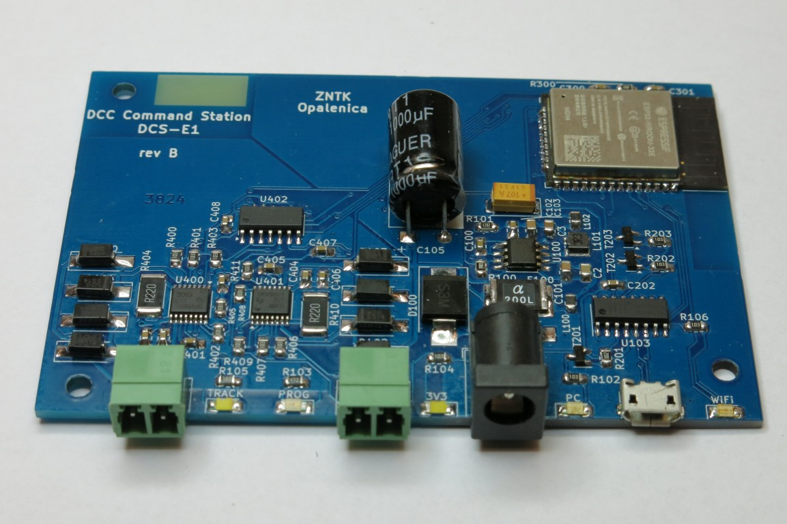

> [!CAUTION]
> Repository moved to https://github.com/zntk-models/DCS-E1
>  This one is probably outdated !

# DCS-E1

## Introduction

Since the Arduino sandwich was not very convenient, I quickly designed my own PCB with ATmega2560 and ESP8266. Unfortunately, the ATmega2560 is quite expensive and increasingly difficult to obtain. In my professional work, I use Espressif solutions on a daily basis, so I decided to use the ESP32 to build my own DCC-EX controller. This is how the DCS-E1 project was born.

It should be noted that the DCC-EX team points out that the code for the ESP32 [is under development](https://dcc-ex.com/reference/hardware/microcontrollers/microcontrollers.html#espressif-esp32-series), but my tests have shown that it works stably. Further software development will probably not affect the connection scheme, so this board will be an excellent platform for running future versions of the code.

## Idea

### Circuit Elements

The basic elements of the circuit are:

* ESP32-WROOM-32E
* ST1S10
* CH340C
* DRV8801

### Assumptions

The goal of the DCS-E1 project was to create a universal platform that allows running DCC-EX software. The idea was to fit all the necessary elements on a single PCB in a compact size, such as:

* Main microcontroller
* WiFi communication module
* USB-UART converter
* Power supply circuit
* Power amplifier/motor driver/track power supply

I also designed a case for this board, which can be printed on a 3D printer.

### History

I have been involved in model railways for almost 30 years. The first models ran on analog tracks. Then, as part of [Poznański Klub Modelarzy Kolejowych](https://www.facebook.com/pkmk.fredry13/), I started using DCC. Of course, I use solutions such as ESU ECoS Command Station or Roco Z21. However, the DCC-EX project interested me due to its ease of construction, small size and quick integration with [JMRI](https://www.jmri.org/), which I use on a daily basis to manage my rolling stock. I quickly found out that the project was very stable. Unfortunately, the Arduino sandwich was not very convenient, so I decided to build my own board with ESP32.

### Real pictures

