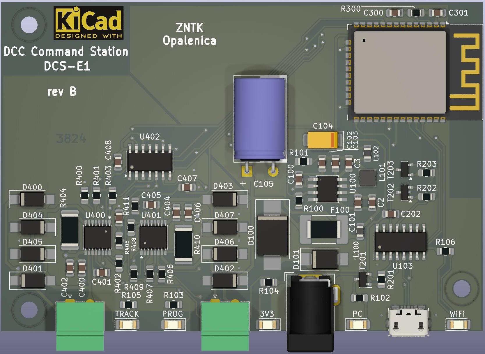

# DCS-E1

## Wstęp

Ponieważ kanapka z Arduino nie była zbyt wygodna, szybko zaprojektowałem własną PCB z ATmega2560 i ESP8266. Niestety ATmega2560 jest dość drogi i coraz trudniej dostępny. W mojej pracy zawodowej na codzień używam rozwiązań Espressif, dlatego postanowiłem wykorzystać ESP32 do zbudowania własnego kontrolera DCC-EX. Tak właśnie powstał projekt DCS-E1.

Należy podkreślić, że zespół DCC-EX zwraca uwagę, iż kod dla ESP32 [jest w fazie rozwoju](https://dcc-ex.com/reference/hardware/microcontrollers/microcontrollers.html#espressif-esp32-series), jednak moje testy wykazały, że działa on stabilnie. Dalszy rozwój oprogramowania nie wpłynie prawdopodobnie na schemat połączeń, dlatego płytka ta będzie doskonałą platformą do uruchamiania kolejnych wersji kodu.

## Idea

### Elementy układu

Podstawowymi elementami układu są:

* ESP32-WROOM-32E
* ST1S10
* CH340C
* DRV8801

### Założenia

Celem projektu DCS-E1 było stworzenie uniwersalnej platformy umożliwiającej uruchomienie oprogramowania DCC-EX. Chodziło o to, aby w kompaktowym rozmiarze, na jednej PCB, zmieścić wszystkie niezbędne elementy, takie jak:

* Główny mikrokontroler, sterujący
* Układ komunikacji WiFi
* Konwerter USB-UART
* Układ zasilania
* Końcówkę mocy/sterownik silnika/zasilanie torów

Specjalnie dla tej płytki zaprojektowałem również obudowę, którą można wydrukować na drukarce 3D.

## Historia

Modelarstwem kolejowym zajmuję się od prawie 30 lat. Pierwsze modele jeździły po analogowym torowisku. Potem, działając w [Poznańskim Klubie Modelarzy Kolejowych](https://www.facebook.com/pkmk.fredry13/), zacząłem używać DCC.
Korzystam oczywiście z rozwiązań takich jak ESU ECoS Command Station, czy Roco Z21. Projekt DCC-EX zainteresował mnie jednak ze względu na łatwość budowy, małe rozmiary i szybką integrację z [JMRI](https://www.jmri.org/), którego używam na codzień do zarządzania moim taborem. Dość szybko przekonałem się, że projekt działa bardzo stabilnie. Niestety kanapka arduino nie była zbyt wygodna, dlatego postanowiłem zbudować własną płytkę z ESP32.
